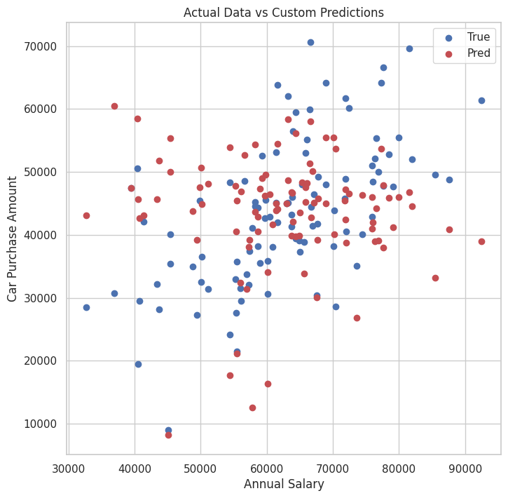

# Neural Network from Scratch (NumPy)
  
  I succesfully implemented `Neural Network` from Scratch using only __NumPy__.
  __NumPy__ was used only for matrix manipulations and some computations, all actual network's logic was built using __plain python__. 
  The goal of the project was to deeply understand how neural networks work under the hood, and I actually understood a concept
  of _back propagation_ with it.

## Overview

* Built a neural network from the scratch
* Implemented a custom Scalar class with automatic differentiation
* Implemented forward and backward propagation manually
* Focused on regression problems
* Used Mean Squared Error (MSE) as the loss function
* Implemented common activation functions:
  * Linear
  * ReLU
  * Softplus
  * Tanh
* Trained the model using gradient descent and mini-batches
* Compared model's predictions with official tensorflow.keras.Sequential model

## Dataset & Comparison

  The model was trained on a car sales price dataset from Kaggle:
  https://www.kaggle.com/datasets/yashpaloswal/ann-car-sales-price-prediction

  To make sure my model actually works, I decided to compare it with official `tensorflow.keras` model using same data and parameters

  I used MSE metric for loss function and used it as metric of accuracy, the lower the loss - the better the model is :D.
  
  Last losses on the train data:
  * Custom Model: 0.020
  * Keras Model: 0.0256

  The results are very close, which shows that the custom neural network works correctly for regression tasks.

  I decided to visualise our custom neural network's predictions and actual data on the same plot to see differences in predictions. I used _test data_ that model hasn't seen yet, and I would say the model has quite high variance, but overall predictions aren't that bad   

P.S. Check notebook to see _keras' predictions_

## Key Takeaways

  * The project helped me fully understand how backpropagation works
  * Every part of the network is transparent and debuggable
  * The implementation is flexible and can be extended with:
    * more layers
    * new activation functions
    * additional metrics
    * different optimizers
    * callbacks and regularization

## Purpose
  
  This project is mainly educational, but it also demonstrates that a well-implemented neural network from scratch can perform competitively on real datasets.
